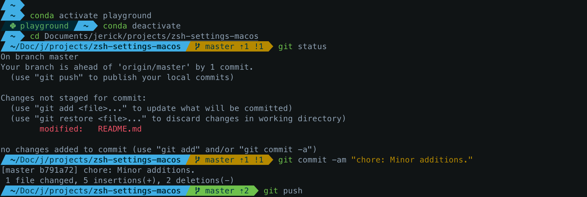

# macOS terminal: iTerm + ZSH + Oh My ZSH + Powerline10k

## Install Homebrew
### Requirements
```bash
xcode-select --install
```

### [Homebrew](https://brew.sh/)
```bash
/bin/bash -c "$(curl -fsSL https://raw.githubusercontent.com/Homebrew/install/master/install.sh)"
```


## Install [iTerm2](https://www.iterm2.com/downloads.html)
>iTerm2 is a replacement for Terminal and the successor to iTerm. It works on Macs with macOS 10.12 or newer. iTerm2 brings the terminal into the modern age with features you never knew you always wanted.

Unpack the `.zip` file and move the app to `/Applications` folder.

## Install ZSH
By default macOS comes with ZSH located in `/bin/zsh`.

```bash
brew install zsh
```

## Install [Oh My ZSH](https://github.com/ohmyzsh/ohmyzsh)
>Oh My Zsh is an open source, community-driven framework for managing your zsh configuration.

Via `curl`:
```bash
sh -c "$(curl -fsSL https://raw.githubusercontent.com/ohmyzsh/ohmyzsh/master/tools/install.sh)"
```

Via `wget`:
```bash
sh -c "$(wget -O- https://raw.githubusercontent.com/ohmyzsh/ohmyzsh/master/tools/install.sh)"
```

## Install Custom Plugins
Oh My ZSH comes with [lots of plugins](https://github.com/ohmyzsh/ohmyzsh/wiki/Plugins) that could be activated from the `~/.zshrc` config file:
```bash
plugins=(
  git
  bundler
  dotenv
  osx
  rake
  rbenv
  ruby
)
```

The `~/.zshrc` config file is usually regenerated when installing Oh My Zsh, and a backup of the previous version is kept, just check your home folder with `ls -a`.

Some other plugins should be installed and added manually to the `plugin` list above to be activated (**all installation methods shown are for Oh My ZSH**):

### [zsh-syntax-highlighting](https://github.com/zsh-users/zsh-syntax-highlighting)
>This package provides syntax highlighting for the shell zsh. It enables highlighting of commands whilst they are typed at a zsh prompt into an interactive terminal. This helps in reviewing commands before running them, particularly in catching syntax errors.
```bash
git clone https://github.com/zsh-users/zsh-syntax-highlighting.git ${ZSH_CUSTOM:-~/.oh-my-zsh/custom}/plugins/zsh-syntax-highlighting
```

### [zsh-autosuggestions](https://github.com/zsh-users/zsh-autosuggestions)
>Fish-like fast/unobtrusive autosuggestions for zsh.
>It suggests commands as you type based on history and completions.
```bash
git clone https://github.com/zsh-users/zsh-autosuggestions ${ZSH_CUSTOM:-~/.oh-my-zsh/custom}/plugins/zsh-autosuggestions
```

### [zsh-completions](https://github.com/zsh-users/zsh-completions)
>Additional completion definitions for Zsh.
>This projects aims at gathering/developing new completion scripts that are not available in Zsh yet. The scripts may be contributed to the Zsh project when stable enough.
```bash
git clone https://github.com/zsh-users/zsh-completions ${ZSH_CUSTOM:=~/.oh-my-zsh/custom}/plugins/zsh-completions
```

### [zsh-apple-touchbar](https://github.com/zsh-users/zsh-apple-touchbar)
>Make your touchbar more powerful.

**Requirements**:

- iTerm2 3.1 or later
- zsh
- ruby 2.3.4 or later (only if you want automatic generation)

```bash
git clone https://github.com/zsh-users/zsh-apple-touchbar $ZSH_CUSTOM/plugins/zsh-apple-touchbar
```

It is fully customizable, check the [docs](https://github.com/zsh-users/zsh-apple-touchbar#customization)!

## Customize Colors
### [Themes](https://github.com/ohmyzsh/ohmyzsh/wiki/Themes)
>In order to enable a theme, set `ZSH_THEME` to the name of the theme in your `~/.zshrc`, before sourcing Oh My Zsh; for example: `ZSH_THEME=robbyrussell`.
>If you do not want any theme enabled, just set `ZSH_THEME` to blank: `ZSH_THEME=""`

#### [POWERLEVEL10K](https://github.com/romkatv/powerlevel10k)
>Powerlevel10k is a theme for Zsh. It emphasizes speed, flexibility and out-of-the-box experience.

##### Installation
```bash
git clone --depth=1 https://github.com/romkatv/powerlevel10k.git ${ZSH_CUSTOM:-$HOME/.oh-my-zsh/custom}/themes/powerlevel10k
```

Select it in your  `~/.zshrc`:
```bash
ZSH_THEME="powerlevel10k/powerlevel10k"
```

##### [Powerline Fonts](https://github.com/Powerlevel9k/powerlevel9k/wiki/Install-Instructions#step-2-install-a-powerline-font)
>Powerlevel10k doesn't require custom fonts but can take advantage of them if they are available. It works well with Nerd Fonts, Source Code Pro, Font Awesome, Powerline, and even the default system fonts. The full choice of style options is available only when using Nerd Fonts.

Recommended Fonts: [Meslo Nerd Font patched for Powerlevel10k](https://github.com/romkatv/powerlevel10k#meslo-nerd-font-patched-for-powerlevel10k).

###### Nerd Fonts
>The Nerd-Fonts project is an effort to create fonts truly tricked out with as many glyphs as possible. After installing `nerd-fonts` and configuring your terminal emulator to use one, configure Powerlevel9k by putting the following in your `~/.zshrc` before you specify the powerlevel9k theme:
>```bash
>POWERLEVEL9K_MODE='nerdfont-complete'
>```

Example: [SF Mono Nerd Font](./SF-Mono-Regular-Nerd-Font-Complete.otf).

##### Settings
Powerlevel9k settings are interpreted almost completely by Powerlevel10k, but the built-in wizard could be used to generate a more complete configuration file; this file will be `~/.p10k.zsh`, and could be used to further customize your experience.

ZSH settings in `~/.zshrc` are still needed.

- Example [`~/.zshrc`](./zshrc_example.zsh) file.
- Example [`~/p10k.zsh`](./p10k_example.zsh) file.

This example files configure this appearance, with the FirefoxDev color scheme:



## iTerm2 Settings
iTerm2 is fully customizable.

### Colors
Download and install a color scheme from [iTerm2 Color Schemes](https://github.com/mbadolato/iTerm2-Color-Schemes).

Sample color scheme: [FirefoxDev.itermcolors](./FirefoxDev.itermcolors)

### Fonts
- [MesloLGS NF Regular.ttf](./MesloLGS%20NF%20Regular.ttf)
- [MesloLGS NF Bold.ttf](./MesloLGS%20NF%20Bold.ttf)
- [MesloLGS NF Italic.ttf](./MesloLGS%20NF%20Italic.ttf)
- [MesloLGS NF Bold Italic.ttf](./MesloLGS%20NF%20Bold%20Italic.ttf)
- [SF-Mono-Regular-Nerd-Font-Complete.otf](./SF-Mono-Regular-Nerd-Font-Complete.otf)
- [SF-Mono.dmg](./SF-Mono.dmg) [Official Link](https://developer.apple.com/fonts/). Use this more complete font set for ASCII characters to provide better control of font weight.

These fonts work better at 11pt or 13 pt.

iTerm2 allows us to select two sets of fonts, for ASCII characters and for non-ASCII characters. Go to `Preferences -> Profiles -> Text -> Font` and select, for example:

- `SF Mono` Semibold `11 pt` as main **Font**.
- `SFMono Nerd Font` Regular `11 pt` as **Non-ASCII Font**.

### Keys

Go to `Preferences -> Profiles -> Keys -> Presets` and select **Natural Text Editing** for a natural typing experience.

### Profile
A profile could load all these settings from a JSON file:

Sample profile: [FirefoxDev.json](./FirefoxDev.json)

### Terminal.app Settings
The same profile, translated to Terminal.app config language:

Sample profile: [FirefoxDev.terminal](./FirefoxDev.terminal)